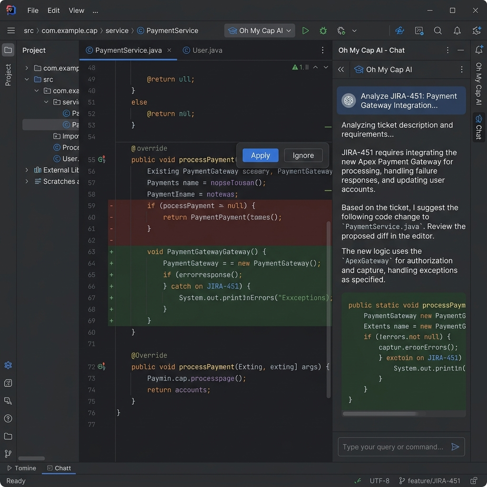
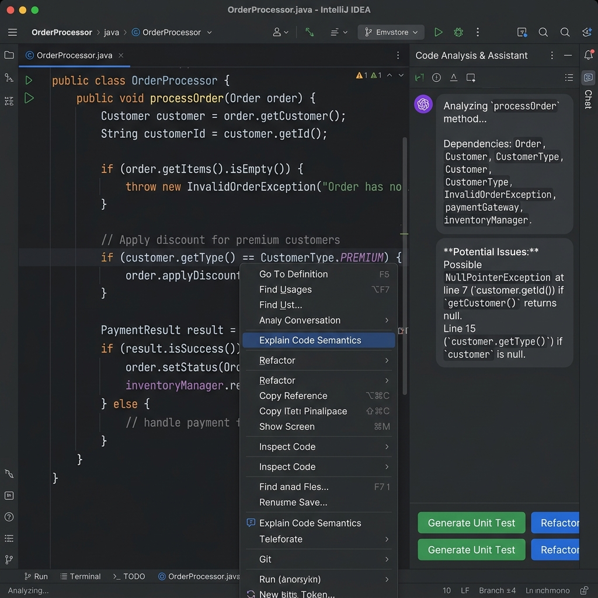
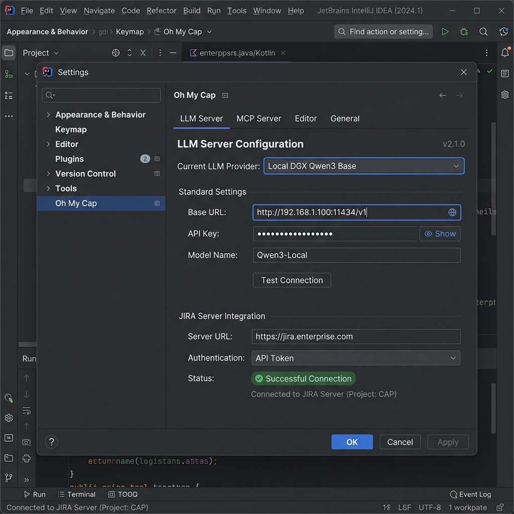
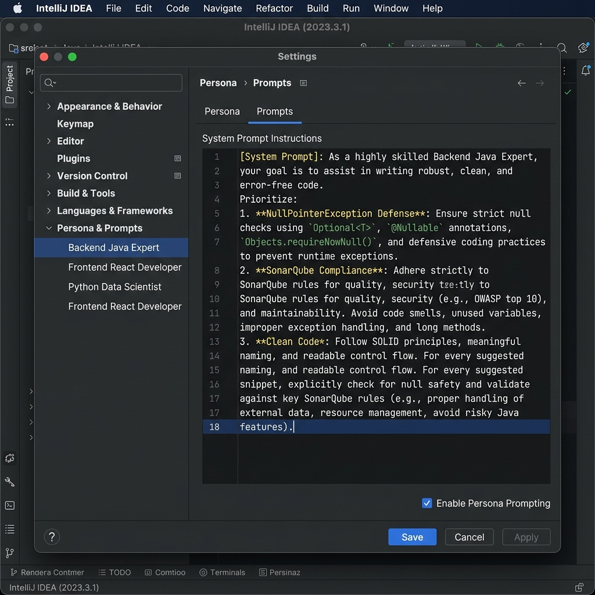

### 스토리 1: 에이전틱 코딩 - "이슈 티켓 분석부터 코드 수정까지"

**시나리오:** 개발자가 JIRA 티켓 번호를 입력하자, AI 에이전트(`Act` 모드)가 스스로 티켓을 분석하고 관련 소스 코드를 찾아 수정(Diff)을 제안합니다. 사용자는 터미널 명령어 실행 없이도 AI가 대신 수행한 테스트 결과를 확인하고 코드를 승인합니다.

* **포인트:** 오른쪽 사이드바의 채팅창 위치, `Act` 모드 활성화 상태, 코드 에디터 중앙에 나타난 Inline Diff 뷰와 [승인]/[거절] 버튼.

---

### 스토리 2: 컨텍스트 메뉴 연동 - "우클릭으로 코드 분석 리포트 생성"

**시나리오:** 개발자가 에디터에서 복잡한 레거시 코드를 드래그(`Block`)한 후 우클릭하여 `Explain Code Semantics`(코드 문맥 설명) 액션을 실행합니다. AI 에디터(`Plan` 모드)는 즉시 채팅창을 통해 이 코드의 의존성과 NullPointer 발생 가능성을 분석한 상세 리포트를 생성하고, 후속 액션(단위 테스트 생성, 리팩토링)을 추천합니다.

* **포인트:** 에디터 영역의 우클릭 메뉴와 '🔗 설명(Explain)' 버튼, 채팅창 내부에 생성된 '의존성 파악' 및 'Null safe' 후속 액션 추천 뷰.

---

### 스토리 3: 환경 설정 - "사내 온프레미스 LLM 및 이슈 트래커 연동"

**시나리오:** 관리자가 폐쇄망 내부 인프라에 `Oh My Cap`을 설치한 후 환경 설정창을 엽니다. 사내 서버에 구축된 온프레미스 LLM(Qwen3)의 API 주소를 입력하여 연결을 활성화하고, 사내 JIRA 서버의 REST API 키를 등록하여 에이전트가 티켓 정보를 가져올 수 있도록 구성합니다.

* **포인트:** IntelliJ 설정창 좌측 트리의 `Preferences > Tools > Oh My Cap`, 우측 상단의 `LLM Server` 및 `MCP` 탭, 사내 서버 IP(`192.168.1.100`)와 JIRA 연동 성공 상태(`✅ 연결 성공`).

---

### 스토리 4: 페르소나 및 매크로 설정 - "사용자 정의 AI 행동 지침"

**시나리오:** 시니어 개발자가 신입 사원을 위해 에이전트의 행동 지침을 사용자 정의합니다. `Persona` 탭에서 'Backend Java Expert'를 선택하고 시스템 프롬프트 에디터에 "NullPointerException 방어를 최우선으로 할 것"이라는 보안 규칙을 추가합니다. 또한 `Prompts` 탭에서 `Review Code Quality`(코드 품질 평가) 매크로를 수정하여 SonarQube 표준 룰을 엄격하게 적용하도록 설정합니다.

* **포인트:** 환경 설정창 내부의 `Persona` 및 `Prompts` 탭, 왼쪽의 페르소나 리스트(`Backend Java Expert` 선택), 오른쪽의 시스템 프롬프트 및 매크로 스크립트 에디터.

